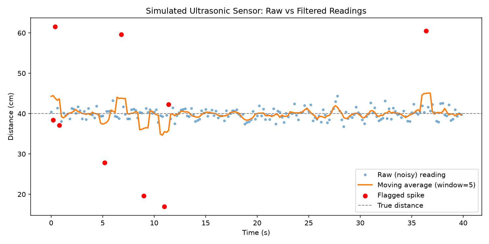

# sensor-data-analysis

Simulates noisy ultrasonic distance readings like the ones from my
[arduino-parking-sensor](https://github.com/raffytaffy627/arduino-parking-sensor)
project, then runs a moving average filter over them and flags spikes. This
is basically the signal-processing side of that project, done in Python
instead of on the actual Arduino - no hardware needed, just numpy generating
fake sensor noise.

## What it does

- Generates 200 fake HC-SR04 readings around a steady 40cm distance, with
  realistic jitter (~1.5cm std dev) plus a handful of random spikes (things
  briefly passing in front of the sensor)
- Smooths the raw signal with a moving average filter
- Flags any reading that deviates too far from the smoothed signal as a
  potential "something happened" alert
- Plots raw vs. filtered data with flagged spikes marked in red



## Download and run (no Python required)

Grab `sensor-data-analysis.exe` from the [Releases](../../releases) page -
it opens straight into the GUI below, no install needed.

## GUI: play with it live

```bash
pip install -r requirements.txt
python3 gui_app.py
```

Sliders for noise, spike count, filter window, and threshold, with the plot
updating in place - this is the easiest way to actually get a feel for how
each parameter changes what gets flagged as a spike. There's a "Save plot as
PNG" button if you want to keep a particular result.

## Command-line version

Requires Python 3, numpy, and matplotlib.

```bash
git clone https://github.com/raffytaffy627/sensor-data-analysis.git
cd sensor-data-analysis
pip install -r requirements.txt
python3 sensor_analysis.py
```

Example output:

```
Simulated 200 readings around a baseline of 40.0 cm.
Flagged 9 spike(s) at t = [0.2, 0.4, 0.8, 5.2, 6.8, 9.0, 11.0, 11.4, 36.4] seconds
Saved plot to sensor_plot.png
```

A window pops up with the plot, and it also gets saved to `sensor_plot.png`.
This is the original script - fixed parameters at the top of the file,
meant for reading the code and understanding the math. `gui_app.py` reuses
the exact same `simulate_readings()` / `moving_average()` / `find_spikes()`
functions, just with slider values instead of hardcoded constants.

## How it works

**Simulating the sensor:** `TRUE_DISTANCE_CM` is the "real" distance an
object sits at. Each reading is that true value plus random Gaussian noise
(`numpy.random.default_rng().normal`), which mimics the small jitter a real
ultrasonic sensor has even when nothing's moving. Then a handful of much
bigger random offsets get injected at random points to simulate something
actually moving in front of the sensor.

**Moving average filter:** a moving average replaces each point with the
average of a small window of points around it. It's the simplest possible
smoothing filter - implemented here as a convolution with a small "box"
kernel (`numpy.convolve`), which is really just "average of the last N
points" done in one vectorized line instead of a manual loop.

**Spike detection:** compare each raw reading to the smoothed signal. If the
gap is bigger than `SPIKE_THRESHOLD_CM`, flag it. Simple, but it works
surprisingly well as long as the threshold is tuned relative to how noisy
your baseline signal actually is.

## Bugs I hit while building this

- **Flagged more spikes than I injected.** I only inject 6 fake spikes, but
  the script consistently flags 9. Turned out to be expected, not a bug: a
  real spike pulls up the moving average for every point in its window, so
  the 1-2 samples *next to* a spike also show an inflated deviation and get
  flagged too. Real spike detectors deal with this the same way - it's a
  tradeoff of using a window-based filter, not something to "fix" so much as
  understand.
- **False spikes at the very start/end of the array.** `numpy.convolve`'s
  default `mode="same"` implicitly zero-pads past the array edges, which
  dragged the moving average toward 0 for the first/last couple of samples
  and made them look like huge (fake) spikes. Fixed by padding the signal
  with edge values (`numpy.pad(..., mode="edge")`) before convolving instead
  of letting convolve zero-pad for me.
- **Picking `SPIKE_THRESHOLD_CM`** took some trial and error - too low and
  normal noise gets flagged as spikes, too high and it misses real ones.
  Settled on 6cm against a ~1.5cm noise std dev, which is roughly "4 standard
  deviations," as a decent balance for this specific simulation.

## Bridging to MATLAB

I just finished MATLAB Onramp, and this maps over pretty directly - same
math, different syntax:

| This script (numpy/matplotlib) | MATLAB equivalent |
|---|---|
| `rng.normal(0, std, n)` | `std .* randn(1, n) ` |
| `np.convolve(padded, kernel, mode="valid")` | `conv(padded, kernel, 'valid')` or `movmean(readings, window)` |
| `np.abs(readings - smoothed)` | `abs(readings - smoothed)` |
| `np.where(deviation > threshold)` | `find(deviation > threshold)` |
| `plt.plot(...)` / `plt.scatter(...)` | `plot(...)` / `scatter(...)` |

MATLAB actually has `movmean()` built in, which does in one call what I did
manually here with `convolve` + padding - so this script is also a decent
example of "here's what a library function is doing under the hood."

## What I learned

- How a moving average filter smooths noise but also lags behind real
  changes in the signal - the bigger the window, the smoother but slower to
  react.
- Why convolution edge behavior matters and can silently mess up your
  results if you don't think about what happens at the boundaries.
- How to reason about a detection threshold in terms of standard deviations
  of noise instead of just guessing a random number.
- That numpy's vectorized array operations replace what would otherwise be
  slow manual for-loops over each reading.
- How to embed a live matplotlib figure inside a tkinter window
  (`FigureCanvasTkAgg`) instead of popping a new window every time you want
  to see an updated plot - and that reusing the same simulation functions
  from `sensor_analysis.py` instead of copy-pasting them into the GUI meant
  the CLI script and the GUI can never quietly drift out of sync.

## Building the exe yourself

```bash
pip install pyinstaller
pyinstaller --onefile --name sensor-data-analysis --windowed gui_app.py
```

`--windowed` suppresses the console window since this is a GUI app - drop it
if you want to see stdout/stderr while debugging a build. The result lands
in `dist/`.

## Roadmap

- [ ] Try an exponential moving average and compare lag/smoothness against
      the simple moving average
- [ ] Feed in real logged data from the actual Arduino sensor instead of
      simulated noise
- [ ] Try implementing the same pipeline in MATLAB directly and compare
